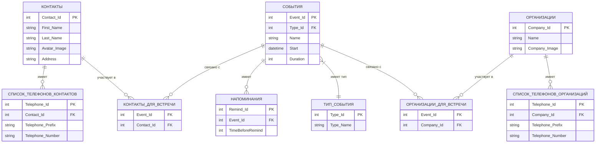

# Органайзер

Простое и надёжное Windows-приложение для управления контактами и расписанием без подключения к интернету.  
Разработано в рамках учебного проекта студентом Санкт-Петербургского государственного бюджетного профессионального образовательного учреждения «Политехнический колледж городского хозяйства».

## Описание

**Органайзер** — это настольное приложение для операционной системы Windows, предназначенное для:
- хранения контактной информации (ФИО, телефон, адрес и др.);
- ведения расписания личных и деловых встреч;
- быстрого поиска по контактам и событиям;
- работы в автономном (офлайн) режиме с локальной базой данных.

Приложение ориентировано на студентов, офисных работников, предпринимателей и всех, кто ценит конфиденциальность и удобство управления личной информацией без зависимости от облачных сервисов.

### ERD-диаграмма

## Начало работы

Эти инструкции помогут вам установить и запустить приложение на локальном компьютере.

### Необходимые условия

Для корректной работы приложения требуется:
- ОС: **Windows 10** или новее;
- Процессор: **Intel Core i3** или аналог;
- Оперативная память: **не менее 2 ГБ**;
- Свободное место на диске: **от 100 МБ**;
- Установленная платформа **.NET** и среда выполнения **C#** (обычно входит в состав Windows).

> Приложение не требует установки внешней СУБД — все данные хранятся локально.

### Установка

Приложение поставляется в виде portable-файла и не требует установки:

1. Скачайте архив с приложением и распакуйте его в удобное место на компьютере.
2. Найдите файл `Organizer.exe`.
3. Запустите его двойным щелчком — приложение готово к работе.

> Все данные (контакты, расписание) будут сохраняться в папке приложения или в локальной пользовательской директории (в зависимости от реализации). Никаких системных изменений или зависимостей не требуется.

## Функциональные возможности

- 📇 Добавление, редактирование и удаление контактов и организаций;
- 🗓 Ведение расписания встреч и событий;
- 🔍 Быстрый поиск по контактам и организациям;
- 💾 Локальное хранение данных — без передачи в облако;
- 🔒 Полная конфиденциальность — работа в офлайн-режиме.

## Технологии

- Язык программирования: **C#**
- Фреймворк: **.NET**
- Графический интерфейс: **Avalonia UI**
- Хранение данных: **локальная база данных**

## Автор

**Иванов Т.М.**  
Студент группы ИП-23-3  
СПб ГБПОУ «Политехнический колледж городского хозяйства»  
